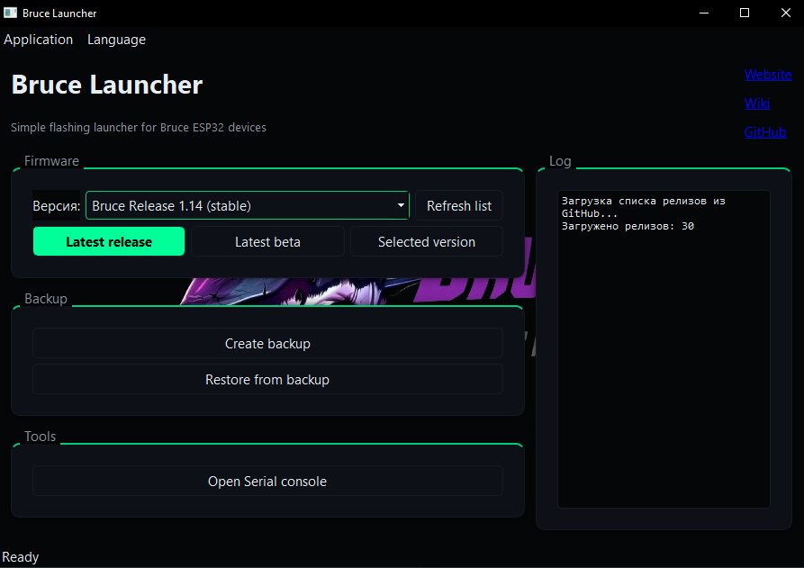

<p align="center">
  
</p>

<p align="center">
  <b>Bruce Launcher</b><br>
  Simple desktop flasher for Bruce ESP32 devices with GitHub releases, backups and a built‑in serial console.
</p>

<p align="center">
  <a href="https://bruce.computer/">
    
  </a>
  <a href="https://wiki.bruce.computer/">
    
  </a>
  <a href="https://github.com/BruceDevices/firmware">
    
  </a>
</p>

<p align="center">
  
  
  
</p>

---

## ✨ Features

- **One-click firmware flashing**
  - Loads **official Bruce firmware releases** directly from GitHub.
  - Supports **latest stable**, **latest beta**, or **manually selected** release.
  - Lets you pick the exact `.bin` asset that matches your board.

- **Backup & restore**
  - Creates a **full flash backup** of your ESP32 / ESP32‑S3 (auto‑detects flash size via `esptool` when possible).
  - Restores backup images back to the device with a confirmation dialog.
  - Opens the backup folder automatically after a successful dump.

- **Serial console**
  - Simple built‑in **serial monitor** with selectable COM port and baudrate.
  - Optional automatic `tone` command on connect (can be toggled in settings).

- **Nice UI & UX**
  - Dark theme inspired by `bruce.computer`.
  - Splash screen on startup, animated progress dialogs for flashing and backups.
  - Log panel with real‑time output from `esptool`.

- **Language switcher**
  - UI available in **Russian** and **English**.
  - Quick toggle via the **Language** menu in the top menubar.

---

## 🖼️ Screenshots

<p align="center">
  
</p>

---

## 🚀 Getting Started (from source)

### Prerequisites

- **Python**: 3.11+ (tested with 3.14 on Windows 10)
- **OS**: Windows 10 or newer
- **Git** (optional, if you clone instead of downloading ZIP)

You also need `esptool` and `PyQt5`, which are already listed in `requirements.txt`.

### Clone or download

```bash
git clone https://github.com/your-user/your-repo.git
cd your-repo
```

Or just download the ZIP from GitHub and extract it, then open that folder in a terminal.

### Install dependencies

From the project root (where `requirements.txt` is located):

```bash
pip install -r requirements.txt
```

### Run the app

```bash
python bruce_launcher.py
```

The launcher will create an app data folder in:

- `C:\Users\<you>\BruceLauncher\`

This folder stores temporary firmware files, backups and `settings.json`.

---

## 📦 Building a Single EXE (PyInstaller)

You can bundle the app into a **single EXE without a console window** using PyInstaller.

### 1. Install PyInstaller

```bash
pip install pyinstaller
```

### 2. Build

From the project root:

```bash
pyinstaller ^
  --noconsole ^
  --onefile ^
  --name BruceLauncher ^
  --icon icon.ico ^
  bruce_launcher.py
```

After a successful build you will get:

- `dist/BruceLauncher.exe`

### 3. Place resources next to the EXE

For images and icons to show correctly in the packaged app, place these files **in the same folder** as `BruceLauncher.exe`:

- `bruce.png` – background artwork for the main window.
- `wLogo.png` – logo used in splash / progress / About dialogs.
- `bLogo.png` – project logo for README / GitHub.

The launcher uses a small helper that looks for resources **next to the EXE** when running as a frozen binary.

---

## 🌍 Language Switching

The app supports a simple two‑language UI:

- **Русский**
- **English**

How it works:

- The current language is stored in `settings.json` under the key `language`.
- On startup the app reads this value and applies labels for:
  - Menus (`Application`, `Language`, etc.)
  - Group boxes (`Firmware`, `Backup`, `Tools`, `Log`)
  - Main buttons and status bar.
- You can switch language at any time from the **Language** menu:
  - `Language → Русский`
  - `Language → English`
- The selection is **persisted**, so next launch will use the last chosen language.

---

## ⚙️ Firmware & Backups Under the Hood

- **GitHub releases**
  - Uses the official firmware repo: `https://github.com/BruceDevices/firmware`.
  - Reads release metadata from the GitHub API and filters `.bin` assets.
  - Special handling for the `lastRelease` tag to treat it as stable even if it’s marked as `prerelease` on GitHub.

- **Flashing**
  - Wraps `esptool` via `subprocess` with a high baudrate (921600 by default).
  - Optional `erase_flash` step controlled by a confirmation dialog.
  - Uses `write_flash 0x0 firmware.bin` for the main image.

- **Backups**
  - Uses `esptool flash_id` to auto‑detect flash size, falls back to **16 MB** if detection fails.
  - Reads full flash range (`read-flash 0x0 <size> backup.bin`).
  - Opens the backup directory when done.

---

## 🧩 Settings

Settings are stored in a JSON file inside the `BruceLauncher` app directory and include:

- **Firmware directory** – where temporary firmware files are downloaded.
- **Backup directory** – where backups are saved.
- **Send `tone` on connect** – optional serial command when opening the console.
- **Ask firmware path each time** – always show a “Save As…” dialog for firmware.
- **Ask backup path each time** – always show a “Save As…” dialog for backups.
- **Chip type** – `ESP32` or `ESP32‑S3` (used for `esptool`).
- **Graphic progress** – toggles splash/progress windows on long operations.
- **Language** – `"ru"` or `"en"` for the UI language.

Most of these can be adjusted from the **Settings** dialog inside the app.

---

## 🤝 Credits

- **Author / UI & implementation**: `ErkinKraft`
- **Bruce firmware & ecosystem**: [`BruceDevices/firmware`](https://github.com/BruceDevices/firmware) and the community around `bruce.computer`.

If you find this launcher useful, consider starring the repo on GitHub and opening issues / PRs for ideas and improvements. 🙂

